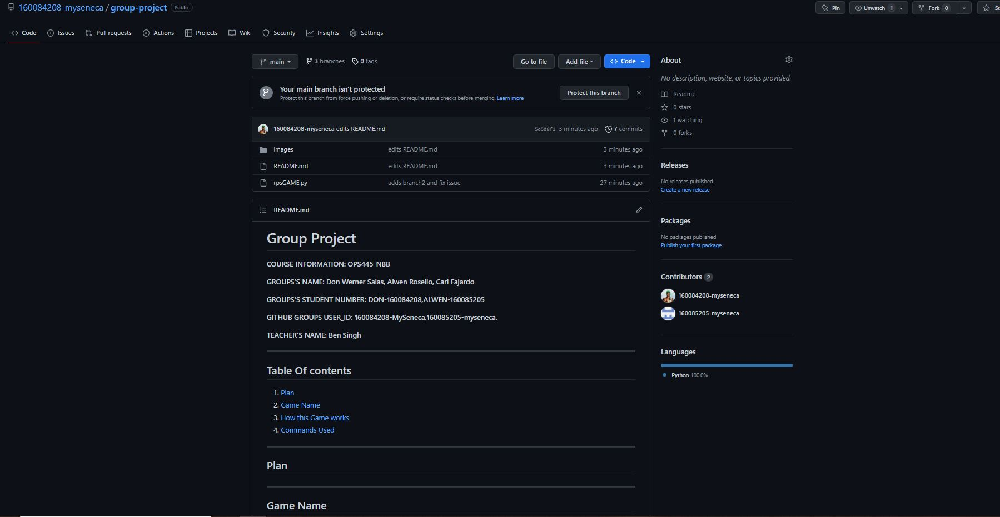

# Group Project 

 **COURSE INFORMATION: OPS445-NBB**

 **GROUPS’S NAME: Don Werner Salas, Alwen Roselio, Carl Fajardo**

 **GROUPS'S STUDENT NUMBER: DON-160084208,ALWEN-160085205, CARL-111522215**

 **GITHUB GROUPS USER_ID: 160084208-MySeneca,160085205-myseneca, 111522215-Myseneca** 

 **TEACHER’S NAME: Ben Singh**

---
 ## **Table Of contents**
1. [Plan](#plan)
2. [Game Name](#game-name)
3. [How this Game works](#how-this-game-works)
4. [Commands Used](#commands-used)

---
# **RPSbyTHEBOYS**
`GAME DEVELOPERS: ALWEN,CARL AND DON`

`DOCUMENTATIONS: ALWEN,CARL`

`VS-CODE AND GITHUB EDITOR: DON`

`SCRIPTS BY: ALWEN,DON,CARL`

# **Plan**

## **How This Game Works**

1. This script imports the `random` module and creates a list of valid options: rock, paper, and scissors.
2. This script enters a loop to play multiple rounds. Within the loop:
3. This script uses `random.choice()` to select a random option from the list for the computer.
4. This script asks the user to input their choice of rock, paper, or scissors.
5. This script checks if the user input is valid. If it's not, the program asks the user to try again.
6. This script prints the user's and computer's options.
7. This script determines the winner based on the rules of Rock-Paper-Scissors.
8. This script asks the user if they want to play again. If the user inputs no, the loop breaks.
9. This script thanks the user for playing when the loop ends.

---

## **Algorithm explaining the game**

- The Rock-Paper-Scissors game operates on an established algorithm that follows these steps: First, initialize a list of valid options (rock, paper, and scissors).

- Then, initiate a loop to play multiple rounds.

- During each round, select an option randomly from the list for the computer using the random.choice() function.

- Prompt the user to input their choice of rock, paper, or scissors, and verify the input for validity.

- If the input is invalid, prompt the user to retry until a valid input is received.

- Display the options chosen by the user and the computer, determine the winner of the round based on the predetermined rules of Rock-Paper-Scissors, and print the winner's name.

- Query the user if they desire to continue playing.

- If the user responds negatively, exit the loop.

- Finally, conclude the game by expressing gratitude to the user for their participation when the loop ends

---

## **Issues**

The issue of this script is that it doesnt prompt the user if he wants to play again or if he wants to continue the game, this script will just continue to loop the same rock/paper/scissors game and to fix this issue i need to create a `exit` statement depedning on if the user wants to continue to play another round

[SCREENSHOT OF THE ISSUE](./images/issue.JPG)

## **Playing The Game:**
First The Game Will Welcome and it will ask you to choose from ROCK,PAPER AND SCISSORS and then if you choose Paper and if you win it prompt that You win if u dont it promt The computer wins and if you tie it promt it ties and lastly the game will ask you if you want to play again if you answer yes it repeats the loop and if you answer no its promt `Thanks For Playing!`

[SCREENSHOT OF THE GAMEPLAY](./images/gameplay.JPG)

## **Deployment**

`git merge Iteration1,2`

---
## **Commands Used**

| COMMANDS USED  | SCREENSHOT     |
| -------------- | --------------|
| `git clone git clone https://github.com/160084208-myseneca/Assignment-1.git` | [COMMAND-SCNREENSHOT](./images/grouprespository.JPG) |
| `git branch Iteration1 ` | [COMMAND-SCNREENSHOT](./images/gitbranch.JPG) |
| `git add .` | [COMMAND-SCNREENSHOT](./images/commit-iteration1.JPG) |
| `git commit -m 'adds rpsGame.py in branch and created branch'` | [COMMAND-SCNREENSHOT](./images/commit-iteration1.JPG) |
| `git push origin Iteration1` | [GITHUB-SCREENSHOT](./images/git-push-Iteration1.JPG) |
| `git branch Iteration2`| [COMMAND-SCNREENSHOT](./images/git-branch-interation2.JPG) |
| `git checkout Iteration2` | [COMMAND-SCNREENSHOT](./images/git-branch-interation2.JPG) |
| `git commit -m '"adds branch2 and fix issue"'` | [COMMAND-SCNREENSHOT](./images/git-branch-interation2.JPG) |
| `git push origin Iteration2` | [GITHUB-SCREENSHOT](./images/github-branch2.JPG) |\
| `git merge Iteration1,2` | [COMMAND-SCNREENSHOT](./images/merge.JPG), [GITHUB-SCREENSHOT](./images/GITHUB-MERGE.JPG) |
